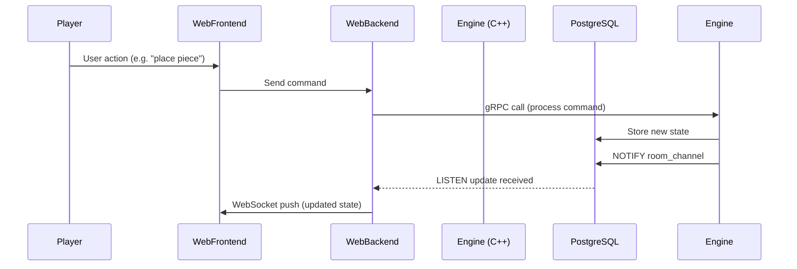

# 🧩 Board Games Application – Architecture Overview

This document describes the architecture and components of the *board-games* application. It is intended to serve as a reference for current and future developers.

---

## 🏗️ Overview

The system is designed to host and manage multiple board games. It supports multiplayer games, persistent game state, and multi-room orchestration. The architecture separates responsibilities across a backend game engine, web interface, and database, using event-driven communication for state updates.

---

## 🧠 Components

### 1. **Game Engine (`engine`)**
- **Language:** C++
- **Build System:** Bazel
- **Responsibilities:**
  - Core game logic and orchestration
  - Handles commands (player actions)
  - Computes new game states
  - Emits status updates via PostgreSQL `NOTIFY`
- **Communication:**
  - Exposes a gRPC service for issuing commands
  - Emits asynchronous updates using PostgreSQL `LISTEN/NOTIFY`

---

### 2. **PostgreSQL Database**
- **Purpose:**
  - Stores game state and metadata (e.g. rooms, players, moves)
  - Acts as the single source of truth
  - Enables persistence and resumability
- **Event System:**
  - Uses `LISTEN/NOTIFY` for real-time game state changes
  - Engine emits NOTIFY messages when updates happen
  - Web backend listens for these updates

---

### 3. **Web Application**
- **Frontend:** SvelteKit
- **Backend:** SvelteKit Server + Adapter
- **Responsibilities:**
  - Hosts the player-facing UI (mobile-focused)
  - Hosts the game board UI (on shared screens or clients)
  - Manages HTTP/WebSocket API for clients
  - Receives commands from players and forwards them via gRPC to the engine
  - Subscribes to database events and pushes updates to clients via WebSockets

---

### 4. **Admin & Dev Interface**
- **Admin:** Django
- **Responsibilities:**
  - Owns the schema and migrations
  - Provides web admin UI to manage games, rooms, players
  - May be used to moderate, inspect or override game state
- **Notes:**
  - Authentication is not a concern in early stages

---

## 🔄 Data Flow Summary

---

## 📦 Technologies

| Component      | Tech Stack                  |
|----------------|-----------------------------|
| Engine         | C++, gRPC, libpqxx, Bazel   |
| Database       | PostgreSQL + LISTEN/NOTIFY  |
| Web Frontend   | SvelteKit, TypeScript       |
| Web Backend    | SvelteKit (adapter)         |
| Admin Backend  | Django (ORM + Admin)        |
| Transport      | gRPC, WebSockets, HTTP      |
| Build System   | Bazel                       |
| Protocol       | Protocol Buffers (protobuf) |

---

## 🧠 Design Philosophy

- **Database-centric architecture:** game state is stored in PostgreSQL and emitted to all consumers via `LISTEN/NOTIFY`.
- **Isolated engine logic:** game logic runs in C++ for performance and separation of concerns.
- **Event-driven UI:** web clients only update when something happens, avoiding polling.
- **Mobile-first interaction:** players use mobile devices to control the game.
